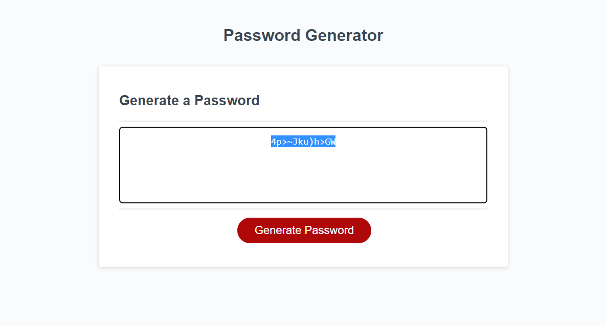

# Password Generator
https://jaspersonja.github.io/password-generator/ 
## Description

My goal for this project was to create an application that will generate a random password given the user input of length and character type. I really put my knowledge of JavaScript to the test to create this page and learned a lot more about what I need to focus my attention on in JavaScript. 

## Usage

To begin generating a new, random password, simply click the 'Generate Password' button and follow the prompts given until a lovely new password appears available for you to copy.
 
  

## License

MIT License

